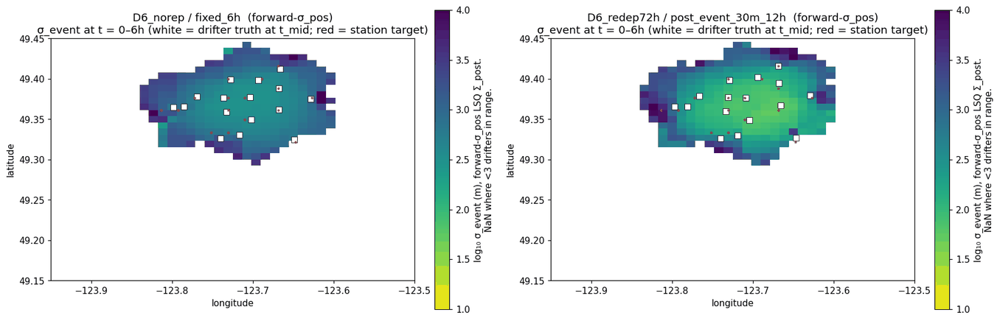
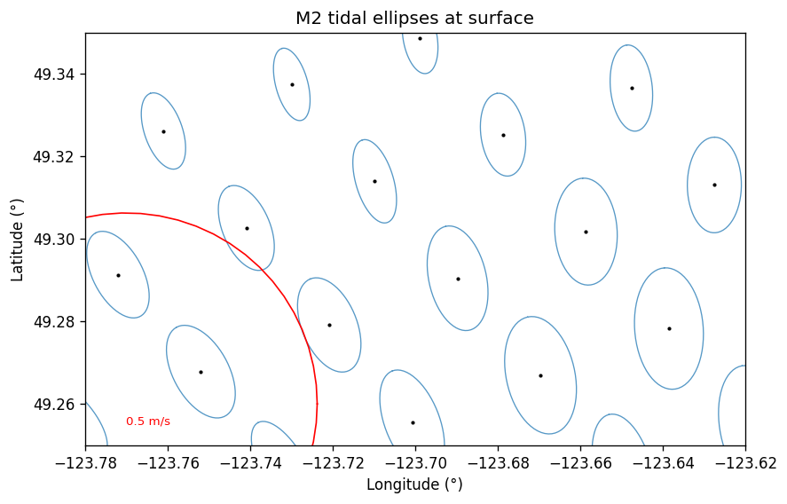
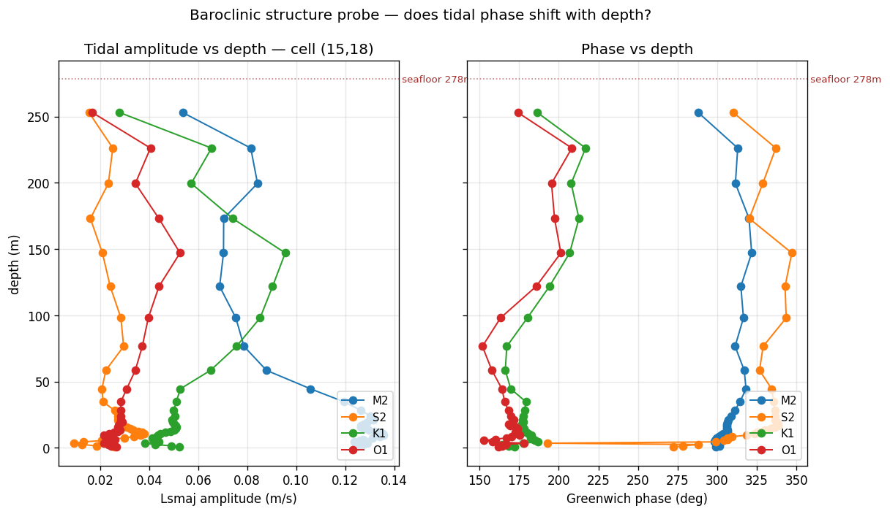
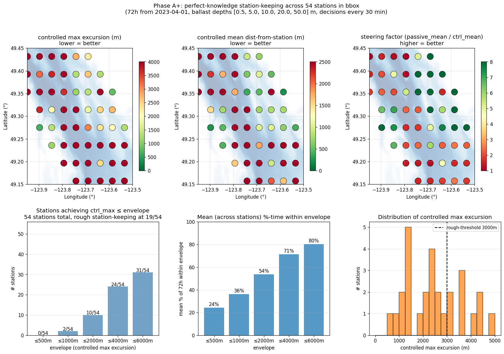
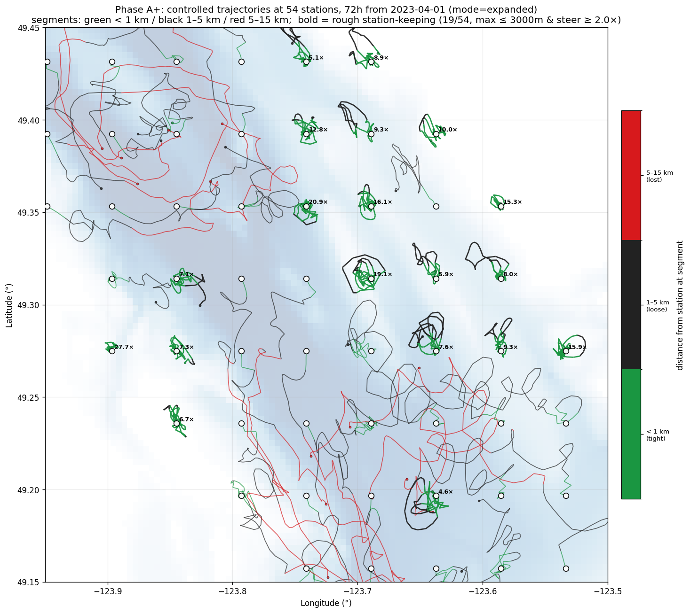
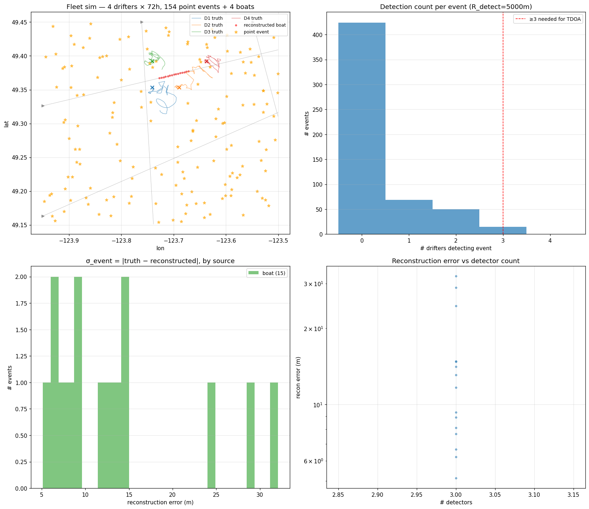
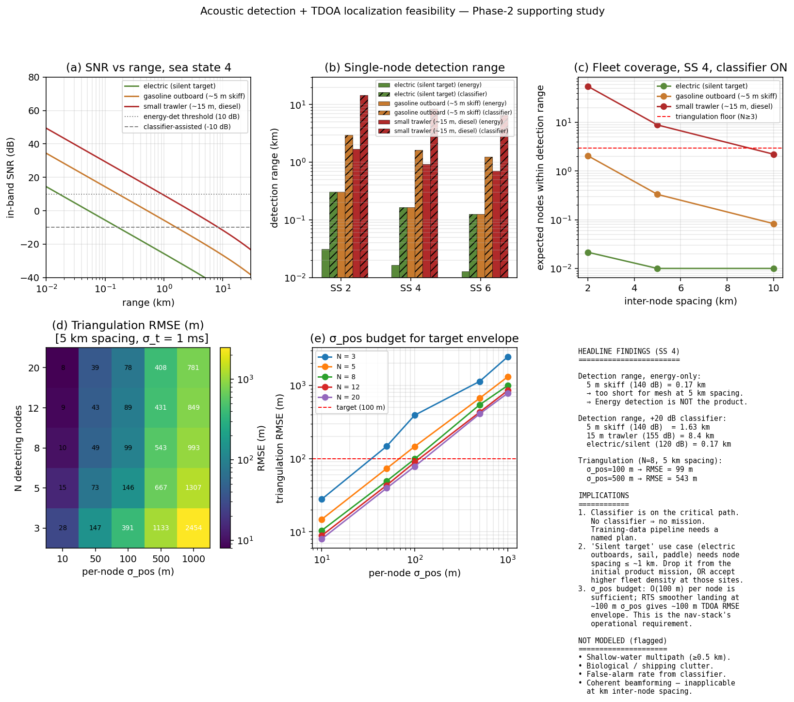

# Maritime acoustic drifter detection nets

Simulation tools for planning fleets of near-passive ocean drifters that
localize dark vessels acoustically — plus an 8-bit FPGA arithmetic engine
showing the onboard estimator can run on ~1 mW.

> 🚧 Work in progress. Everything here is simulation against real ocean
> reanalysis data; no hardware has been deployed. See [docs/status.md](docs/status.md)
> for an honest accounting of what's done, what's in flight, and what's on hold.



*One week of simulated fleet coverage in the Strait of Georgia, in 6-hour
steps. Color is the expected vessel-localization error (log₁₀ meters) if an
acoustic contact occurred at that point in that window — yellow ≈ 10–100 m,
dark ≈ kilometers, blank = fewer than 3 drifters in range. White squares are
the 16 drifters; red dots are their planned stations. **Left:** drop once,
surface on a fixed 6-hour schedule. **Right:** event-driven surfacing plus a
72-hour redeployment cycle — 36 % more coverage and 80 m median localization
error, at less than half the surfacing power budget of a fixed-schedule
fleet with the same redeployment cycle.*

---

## What this is

Two workstreams, one question: **how much sensing can you get out of hardware
that mostly does nothing?**

1. **[Fleet planning & coverage](#the-planning-stack)** (active) — a
   fast-iteration simulation stack for drifting acoustic sensors in the
   Salish Sea: tidal-current physics from real reanalysis data, per-drifter
   navigation (particle filter + bias Kalman + MPC depth control), passive
   acoustic detection with TDOA triangulation, and fleet-level planning —
   drop-point optimization, surfacing policies, redeployment cycles.

2. **[The LNS8 FPGA engine](#the-lns8-fpga-engine)** (dormant milestone) — a
   complete 8-bit logarithmic-number-system ALU and 6-D particle filter in
   Verilog: 304 bytes of lookup tables, ~2100 LUTs, sub-milliwatt operation
   on a ~$5 FPGA. It began as a hunt for a practical use of the EML operator
   `eml(x, y) = exp(x) − ln(y)` ([Odrzywołek 2026](https://arxiv.org/abs/2603.21852))
   and ended with an honest negative result: the LNS arithmetic carries all
   the value. The particle filter survived the pivot; the operator didn't.

The connection: a drifter has no propeller and a coin-cell-scale power
budget, so the state estimator is the main compute load. The fleet
simulations establish *what* that estimator must compute (particle counts,
sensor mix, precision, update rate); the FPGA work is the existence proof
that the answer fits in milliwatts.

---

## Why drifters?

The motivating use case is persistent, wide-area monitoring of coastal
waters for **small dark vessels** — sub-15 m, AIS off, silent running.
Roughly 75 % of industrial fishing activity is publicly untracked
([Paolo et al., *Nature* 2024](https://www.nature.com/articles/s41586-023-06825-8));
the same gap covers smuggling routes, marine-protected-area violations, and
remote-coast activity. Every existing option fails it differently:

| Option | Why it falls short here |
|---|---|
| Satellites (SAR / optical) | A sub-15 m vessel is at or below the practical SAR detection floor, invisible under cloud to optical, with days between usable passes |
| Patrol vessels & aircraft | Persistent presence over thousands of km² is unaffordable; sorties are intermittent and announce themselves |
| Fixed seabed arrays | Capable but expensive to install, immobile, and can't follow seasonal activity |
| Powered USVs, gliders, sailbuoys | Tens to hundreds of thousands of dollars per unit caps fleets at handfuls; propulsion and station-keeping dominate the power budget |
| **Drifting acoustic mesh** | Cheap enough to field by the hundreds and treat as attritable; passive acoustics hears what satellites can't see; near-zero power because it doesn't fight the ocean |

The catch — and the reason this repo exists — is that a drifting sensor's
coverage is no longer a hardware property. It's an *output of planning*:
where you drop the nodes, when they surface to fix their positions, and how
often you replace the ones that wander off. Riding depth-dependent currents
recovers some steering authority, but the real leverage is in the planning
loop. Quantifying exactly how much coverage each planning decision buys is
what the stack below does.

---

## The planning stack

`experiments/harmonic_prototype/` — scripted, numpy/JAX, optimized for
research velocity. Full findings log: [FINDINGS.md](experiments/harmonic_prototype/FINDINGS.md).
For a plain-English walkthrough of what's under the hood — the ocean
structure being recovered, how the particle filter and bias learning work,
and why the radio shapes everything — see
**[docs/how_it_works.md](docs/how_it_works.md)**.

### The concept

A drifter with no propulsion can still steer: currents in the Strait of
Georgia differ in direction and phase by depth (the M2 tide lags 33° — about
1.1 hours — between the surface and 24 m). A ballast pump that moves the
drifter vertically chooses *which current to ride*. The stack quantifies how
far that gets you, end to end:

| Layer | What it does | Where |
|---|---|---|
| Ocean truth | SalishSeaCast reanalysis (NEMO, 0.5 km grid, hourly, 40 depth levels) + UTide harmonic decomposition | `01`–`07_*.py` |
| Drifter physics | Depth-dependent drift, ballast control authority, drag modulation | `09`–`16_*.py` |
| Navigation | Particle filter fusing LoRa time-of-arrival ranging to fixed anchor buoys, CTD salinity/temperature (a water-mass position cue), sparse GPS; bias-Kalman current learning; MPC depth controller; RTS smoothing for retrospective accuracy | `rbpf_prototype/`, `18`–`22_*.py` |
| Acoustics | Detection-range model (energy vs. classifier-assisted), TDOA triangulation when ≥3 drifters hear the same event | `23_acoustic_detection.py` |
| Fleet layer | End-to-end mission sim, drop-point optimizer, drifter mobility maps, surfacing policies, redeployment triggers, parameter sweeps | `_fleet_sim_v0.py`, `_drop_point_optimizer.py`, `_fleet_sweep_v0.py` |

### Headline result

From the [continuous-coverage campaign](docs/findings_campaign_2026-04-30.md)
(16 drifters, 168-hour missions, ~600 acoustic events):

| policy × redeploy | coverage | reconstruction rate | median σ_event | surfacings/wk |
|---|---:|---:|---:|---:|
| fixed 6 h, no redeploy | 0.256 | 13 % | — | ~448 |
| fixed 6 h, 72 h redeploy | 0.305 | 23 % | 204 m | ~1344 |
| event-driven, no redeploy | 0.156 | 19 % | 96 m | ~200 |
| **event-driven, 72 h redeploy** | **0.349** | **26 %** | **80 m** | **~600** |

Event-driven surfacing ("surface 30 minutes after hearing something") wins on
every axis at half the power cost — but *only* paired with redeployment: a
drifter that drifts out of audible range stops surfacing and its position
confidence collapses (+124 % coverage from redeploy under this policy, vs.
+19 % under the fixed schedule). Coverage half-life is ~2.5 hours, set by
surfacing cadence, not week-scale drift.

### How the simulation is built

The failure mode this kind of project has to guard against isn't a crash —
it's a flattering result. A simulated estimator that quietly reads the truth
field, enjoys perfect clock sync, or samples sensors at unlimited rates
produces coverage numbers that mean nothing. The architecture treats honesty
as a structural property (full charter:
[docs/simulation_integrity.md](docs/simulation_integrity.md)):

- **Truth and belief are separate modules.** The real ocean state and the
  estimator's observation world live in different schemas, so estimator code
  can't read what a deployed node couldn't know — backed by import-linter
  forbidden-import contracts and typed signatures, not a comment asking
  developers to behave.
- **Nodes are skeuomorphic compositions.** A node is a bundle of physical
  components assembled once by a factory (`make_pure_drifter`,
  `make_anchor`). A drifter can't produce a GPS observation because no GPS
  component was attached — capability is component presence, not a runtime
  flag that can be set wrong.
- **Deployment-honest metrics.** Anything called "coverage" uses the
  forward-filter uncertainty a node would actually have live; retrospective
  smoothed accuracy is reported separately and labeled as such.
- **An explicit ledger of gaps.** Every integrity concern is paired with its
  enforcing mechanism in the charter's matrix — or recorded as a known gap
  (biofouling, clock-drift tiers, land collision). Unmodeled is allowed;
  unacknowledged is not.
- **Two-speed development.** This scripted stack wins on iteration velocity.
  A heavier composed framework with type-level invariants and spec contracts
  (`rtl/vectors/maritime/`, `openspec/`) is being grown behind it — currently
  paused — and published experiment scripts are frozen baselines: new work
  goes in new files.

### Estimator and planning structure

Per-drifter inference is a **Rao-Blackwellized particle filter**: particles
carry position hypotheses, and conditioned on each particle a Kalman filter
tracks a reduced-rank current-bias field (Matérn-correlated grid basis,
~5 km correlation length, resolved per depth slab) describing how the local
ocean differs from the climatological prior. The bias being learned is
*structural*, not a free-form grid: the field's scales, depth resolution,
and noise budget are built around the physical layers of the ocean error
model (Fraser plume slab, wind layer, basin-coherent residual — each with
its own horizontal scale and depth reach). Observations are LoRa
time-of-arrival ranges to the fixed anchor buoys, CTD
temperature/salinity — salinity doubles as a position cue against the
plume's sharp freshwater structure — and a GPS fix at each surfacing. The
noise decomposition is explicit: ocean-variability scales the bias state
can structurally represent go in its prior, scales it can't go in the
observation noise — putting them in both double-counts and suppresses the
Kalman gain.

The same mission record is used in two time directions. The **forward
filter** is what the drifter knows live — it drives the depth controller and
the deployment-honest coverage metric. An **RTS smoother** runs backward
from each surfacing fix to recover where the drifter *was* at acoustic event
time, which is what TDOA triangulation actually consumes. Position accuracy
is needed retroactively, not live — that asymmetry is what makes the
power budget work.

Planning is a stack of nested horizons, each layer tuned against closed-loop
simulation of the layer below it:

| Layer | Decides | Cadence / horizon |
|---|---|---|
| MPC depth control | which current to ride (ballast setpoint plan) | every 30 min over a 12-interval receding horizon |
| Surfacing policy | when to spend power on a fix + exfiltration | event-driven, with a 12 h no-event safety cap |
| Drop placement | where to put N drifters | greedy + local refinement against a 72 h coverage objective |
| Redeployment | which drifters to replace, and where | 72 h cycle plus out-of-zone / σ_pos-degradation triggers |

The depth controller plans by beam search (width 200) over depth sequences,
with JAX-jitted rollouts through the NEMO current grid and CVaR scoring on
predicted station error and position-uncertainty growth. The surfacing
policy uses a track-divergence test rather than per-ping triggering: surface
~30 minutes after a heard contact diverges >500 m from the last exfiltrated
track, so one surfacing per "boat behavior change" instead of one per ping.
The drop optimizer consumes per-site mobility maps measured from the
controller running closed-loop — so placement already accounts for how well
station-keeping works at each site, not just where coverage is wanted.

### Gallery

| | |
|---|---|
|  |  |
| *Tidal-current polarization ellipses across the strait — the directional structure a drifter can exploit.* | *Baroclinic M2: amplitude and phase vs. depth. The 33° surface-to-24 m lag is the steering authority.* |
|  |  |
| *Where station-keeping is physically feasible: 54-station survey under perfect-knowledge depth control.* | *72-hour controlled trajectories at each surveyed station — green holds within 1 km, red drifts >5 km.* |
|  |  |
| *End-to-end mission: drifter tracks, acoustic events, TDOA reconstructions.* | *Detection range vs. target class and sea state; triangulation error budget.* |

The full evolving-coverage animation for the winning configuration:
[coverage_smart_redeploy.gif](docs/media/coverage_smart_redeploy.gif).
GIFs are rebuilt from sweep frames with `uv run python dev/make_readme_media.py`.

---

## The LNS8 FPGA engine

`rtl/` (22 Verilog modules) + `experiments/01`–`11_*.py` (theory, precision
studies, cycle-accurate Python reference).

This is where the project started — as a nerd-snipe. Odrzywołek 2026
([arXiv:2603.21852](https://arxiv.org/abs/2603.21852)) shows that the single
operator `eml(x, y) = exp(x) − ln(y)`, composed with the constant 1,
generates every elementary function — a continuous analog of the NAND gate.
Hunting for a practical use led to logarithmic number systems, where exp and
ln are nearly-free table lookups, and from there to the question that stuck:
**how small can a real estimator get?** The proving ground became a 6-D
particle filter (position + velocity, 128 particles, 3 sensors) targeting
the iCE40UP5K, a ~$5 FPGA:

- **Integer-only 8-bit LNS ALU** — MUL/DIV in 1 cycle, ADD in 4 (Gaussian-log
  table), EXP/LN in 2 (48-byte coefficient ROMs).
- **Full PF pipeline in RTL** — microcoded predict/weight sequencer,
  systematic resampler, two-phase estimator, dual-bank SPRAM particle store,
  SPI interface. End-to-end testbench runs 128 particles × 100 steps against
  a cycle-accurate Python golden reference.
- **Accuracy** — plain LNS8 hits a precision cliff on large position
  coordinates (10× worse than float64); a delta-encoding scheme (positions
  stored as offsets from a slowly-updated reference) recovers **1.2× float64
  RMSE at 752 Hz** (50 MHz clock).
- **Synthesis** — ~2124 LUTs (40 % of the UP5K), 17 BRAMs. Estimated power:
  **0.12 mW at 1 MHz** (14 PF steps/s) to 1.57 mW at 30 MHz (406 steps/s).

The negative result worth recording: **EML itself never earned a place in
the design.** Once a real workload was on the table, the useful primitive
set was plain LNS MUL/DIV/ADD/EXP/LN — the one-operator elegance bought
nothing. What survived is the LNS engine, and the question of what it should
compute, which is what the fleet simulations above exist to answer.

Status: verified in simulation and synthesized; not yet run on physical
hardware. Deliberately dormant — the next design decisions (LNS10? which
sensor models in ROM?) should be driven by measured demands from the fleet
simulations, not guesses. History: [docs/archive/](docs/archive/).

---

## Repository map

```
experiments/
  01–11_*.py            EML theory, LNS precision studies, PF prototypes (frozen baseline)
  harmonic_prototype/   active maritime stack: physics, nav, acoustics, fleet sims
rtl/                    LNS8 ALU + 6-D particle filter in Verilog; testbenches, synth, vectors
docs/                   curated docs (see docs/README.md) + raw research notes
docs/media/             README figures and GIFs
openspec/               spec-driven change proposals and standing specs
references/             key papers
```

Start with [docs/README.md](docs/README.md) for a reading order;
[docs/overview.md](docs/overview.md) for the vision and system design;
[docs/status.md](docs/status.md) for current state.

## Running

Python via [uv](https://docs.astral.sh/uv/) — no venv setup needed:

```bash
uv run --with numpy --with scipy --with matplotlib python experiments/harmonic_prototype/05_visualize.py
make -C rtl sim_alu          # iverilog unit tests for the LNS8 ALU
```

Most `harmonic_prototype` scripts document their knobs in a top-of-file
docstring; sweep outputs land in `experiments/harmonic_prototype/figures/`.

## About

A personal research project by [Tim Radcliffe](https://tradcliffe.com).
Apart from the cited paper (Odrzywołek 2026, [arXiv:2603.21852](https://arxiv.org/abs/2603.21852))
and the [SalishSeaCast](https://salishsea.eos.ubc.ca/) reanalysis it builds
on, all simulation, RTL, and analysis here is original work.
